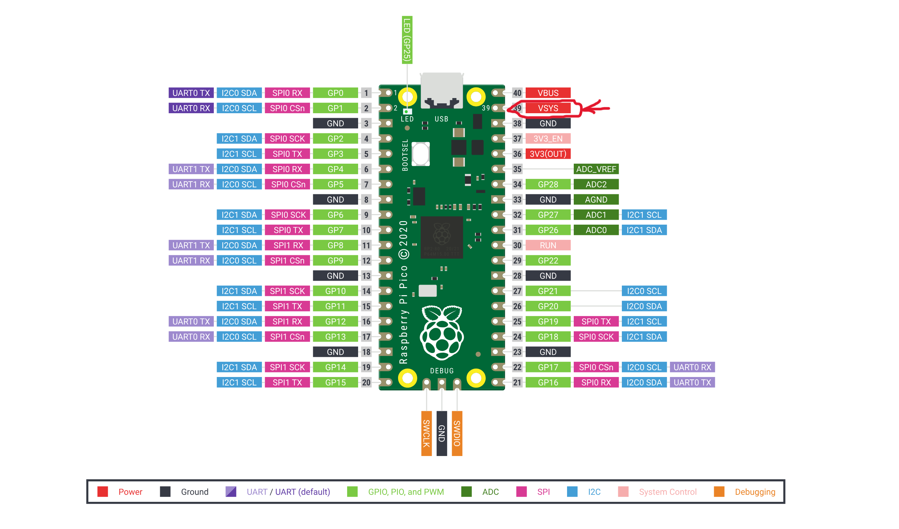

## Project Overview
This project, developed by Drew Rigby as a capstone for the Applied Computing major at the University of Washington Bothell, integrates computer science concepts with oceanography, reflecting the intersection of my major and minor. The objective was to design and build an automated pH sensor capable of sampling water and providing accurate pH measurements.

An important goal of this project is to make it accessible for high school students, even those with little to no background in oceanography, coding, or electrical engineering. To achieve this, the project includes a comprehensive manual that provides detailed, step-by-step instructions, ensuring that anyone can build, use, and understand the sensor regardless of prior experience. This focus on accessibility aims to inspire students and foster interest in STEM and environmental science.

### What is pH and how is it important to oceanography?
pH measures the acidity or alkalinity of a substance. This project focuses specifically on the pH of water, a critical parameter in oceanography. One of the most pressing issues in this field is ocean acidification, a phenomenon where the ocean's pH decreases, becoming more acidic.

Ocean acidification has far-reaching consequences for marine ecosystems. For example, reduced levels of calcium carbonate in acidic waters hinder marine organisms, such as mollusks and corals, from forming their shells and skeletons. This disruption cascades through the food chain, potentially impacting human industries and livelihoods. Monitoring pH levels in vulnerable areas can provide valuable insights into the causes and effects of ocean acidification, aiding research and mitigation efforts.

### What relevance does this have to computer science?
This project leverages computer science principles through the use of a Raspberry Pi Pico and embedded systems programming to bring the sensor to life. I applied my expertise to develop a library that simplifies interaction with the sensor, enabling users to perform essential tasks with straightforward functions while maintaining flexibility for advanced customization.

For example, users can easily explore different configurations, such as testing alternative calibration curves using purple instead of green color indicators, by utilizing specific functions provided in the library. This design empowers users to adapt the sensor's functionality to their needs, balancing ease of use with the ability to conduct more complex experiments.


### What Use Might This Project Have in High School Curriculums?
This project is an excellent tool for high school science curriculums, offering students hands-on experience with STEM concepts while encouraging critical thinking and hypothesis testing. The sensor’s flexibility, made possible through its programmable library, allows students to explore a variety of experiments and customize its functionality to suit their needs. For instance, the library includes functions that enable users to adjust calibration curves or test alternative parameters, such as using different color indicators for measurements.

This adaptability provides students with the opportunity to investigate real-world scientific questions, such as how environmental factors like temperature or salinity influence pH levels. By designing and conducting their experiments, students can better understand the scientific method and the role of data in validating hypotheses. The comprehensive manual ensures accessibility, making the sensor usable even by those with little to no prior knowledge of oceanography, coding, or electrical engineering. This combination of flexibility, ease of use, and educational potential makes the project an invaluable resource for inspiring curiosity and fostering skills in STEM fields.

## Why use this as a project?
This project offers a unique blend of accessibility, adaptability, and real-world relevance, making it an excellent choice for educators, students, and STEM enthusiasts alike.

Hands-On Learning: The sensor provides a tangible way to explore STEM concepts, bridging the gap between theory and practice. Students can learn about coding, embedded systems, and environmental science while working on a meaningful, real-world application.

Flexibility: The custom library included with the project allows for significant experimentation and customization. Users can test various calibration methods, explore alternative parameters, and tailor the sensor’s functionality to align with specific learning objectives or experiments.

Accessibility: Designed with ease of use in mind, this project is accessible to individuals with minimal background knowledge in coding, oceanography, or electrical engineering. The detailed manual ensures that even beginners can confidently assemble, program, and operate the sensor.

Real-World Relevance: By focusing on issues like ocean acidification, this project highlights the critical role of technology in addressing environmental challenges. It inspires students to think about how STEM disciplines can be applied to solve pressing global problems.

Incorporating this project into a classroom or individual learning plan can spark curiosity, enhance problem-solving skills, and encourage exploration in the interconnected fields of science and technology.


## What will I need?

|ITEM|QUANTITY|PRICE|
|---|---|---|
|[Raspberry Pi Pico](https://www.adafruit.com/product/5525)|1|$5|
|[Submersible 3V DV Water Pump](https://www.adafruit.com/product/4547)|1|$2.95|
|[Adafruit TSL2561*](https://www.voc-electronics.com/a-37456119/sensors-breakout-kits/adafruit-tsl2561-digital-luminosity-lux-light-sensor-breakout/#description)|1|$7.31|
|[Common Cathode RGB Light](https://www.sparkfun.com/products/105)|1|$2.25|
|[Phenol Red pH Indicator Dye](https://www.poolweb.com/products/taylor-ph-indicator-solution-3-4-oz-dropper-bottle-r-0014-a)|1|$3.38|
|[GT-U7 GPS](https://www.amazon.com/Navigation-Satellite-Compatible-Microcontroller-Geekstory/dp/B07PRGBLX7)|1|$14.99|
|[Cuvette 1.5ML *This link only sells by the 10s*](https://www.amazon.com/Standard-Disposable-Professional-Transparent-Spectrophotometers/dp/B07VGDLMMH/ref=sr_1_3?c=ts&dib=eyJ2IjoiMSJ9.Wdu-PneNgzy9HWgzqQpF4NBLH8vNxU3TnJP97jJI6K5CkgJXkyv-UAtbcqg3fmO8-xdRdEMT4H2ownpaVPMMaHXzsNkF2tbxrW2HuE7zxEcOtA-MBHBYkHV6HmPOE7fLuzGbI9rZSdy10q5kvpcnMFaT6kUqf7-DJbqa2snUjLDDArWAbArXT2QCQDNtBNRAVqzQem_6vUD536fPMKD2lA25uliqrV63WyjNQt6MhQQZa2gJIJN3Nr4TtDbrs_wtAlUK7JVekIs8ODg29hQC5DgXq_pKflS9gyPv6p5u7JI.71dC1E2u98ecs3xq6WpQIMiJ2LN3HRsqwCd--ipGPMc&dib_tag=se&keywords=Lab+Cuvettes&qid=1731213259&s=industrial&sr=1-3&ts_id=318063011)|1|$11.89|
|[20ML Syringe](https://aaprintsupplyco.com/products/neo-sy?variant=32983529488468&currency=USD&utm_medium=product_sync&utm_source=google&utm_content=sag_organic&utm_campaign=sag_organic&srsltid=AfmBOoqIWNiGqBFyY0_SuPJI8O2K_qD1SE5h-Gxxlw2TRUkzQtm_g3tpRyg)|1|$2|
|[Plastic Water Resivour of your choosing](https://www.berlinpackaging.com/3600b03-2-oz-natural-hdpe-plastic-wide-mouth-packer-bottles-white-screw-top-cap/?utm_source=google&utm_medium=cpc&utm_campaign=PMax%3A%20%28ROI%29%20Shopping%20-%20Smart%20-%20Bottles%20-%20HDPE&utm_id=21016660230&utm_content=&utm_term=&gad_source=1&gclid=CjwKCAjw9cCyBhBzEiwAJTUWNQKtTxFOMuFaX5nl7jv3UimzFBc7M9naBo_MlGrCpJRQH1XFCfGRXBoCqS4QAvD_BwE)|1|$0.38|
|[Peristaltic Pump](https://www.adafruit.com/product/1150)|1|$24.95|
|[Relay](https://www.elecbee.com/en-29076-3V-1-Channl-Relay-Isolated-Drive-Control-Module-High-Level-Driver-Board)|3|$7.99|
|[Tubing](https://www.adafruit.com/product/4545)|2|$1.50|
|[Valve](https://www.amazon.com/SNS-Electric-Solenoid-Normally-Closed/dp/B0D4QN114D)|1|$15.69|
|[Adaptors](https://www.homedepot.com/p/Everbilt-1-4-in-Barb-x-1-4-in-MIP-Brass-Adapter-Fitting-800119/300096726?source=shoppingads&locale=en-US)|2|$4.45|
|Total||$116.62|

\* *They no longer make these sensors but this is all I had access to. In theory any sensor should work you would just need to change the library*
### Deployment Materials
You as the user will have to choose how you would like to deploy the sensor. I have the sensor mounted onto a boogie board with pool noodles attached as that provide flotation for sensor. I will include those materials listed here however
it is important to think of your use case for the sensor and if you will need sturdier materials or if you dont plan to deploy it on water at all instead from a dock.
|ITEM|QUANTITY|PRICE|
|---|---|---|
|[Boogie Board](https://www.dickssportinggoods.com/p/dbx-33-inbodyboard-19dbxudbx33bdybrdsbb/19dbxudbx33bdybrdsbb?sku=25341944&srsltid=AfmBOoplDu2-M7iMlmrVefRNFGweKAaN4pFO5CtZ6sZXx5XDULClXj2LsxM)|1|$14.99|
|[Pool Noodle](https://www.amazon.com/Swimming-Floating-Projects-Exercise-Accessories/dp/B0D5D16BLV?th=1)|2|$0.98|
|[Water Proof Casing](https://www.amazon.com/Waterproof-Plastic-Electronic-Junction-Enclosure/dp/B07M5SZNR9/ref=asc_df_B07M5SZNR9/?tag=hyprod-20&linkCode=df0&hvadid=693308318554&hvpos=&hvnetw=g&hvrand=13402671431230684644&hvpone=&hvptwo=&hvqmt=&hvdev=c&hvdvcmdl=&hvlocint=&hvlocphy=9033316&hvtargid=pla-615797795038&psc=1&mcid=7bd63229ef183828938a82ddd5446444&gad_source=1)|1|$9.49|
|[Cable Gland](https://www.adafruit.com/product/762)|2|$1.95|
|[Ruler](https://www.amazon.com/Mr-Stainless-Centimeters-Drawing-Measuring/dp/B07ZS4JSQP/ref=sxin_17_pa_sp_search_thematic-asin_sspa?content-id=amzn1.sym.04f61faa-8c24-439e-ba3b-8f0078642c9d%3Aamzn1.sym.04f61faa-8c24-439e-ba3b-8f0078642c9d&cv_ct_cx=12+inch+ruler+with+3+holes&keywords=12+inch+ruler+with+3+holes&pd_rd_i=B07ZS4JSQP&pd_rd_r=5daf147d-a691-4b7d-ab83-7f7bf00ba648&pd_rd_w=YHUGZ&pd_rd_wg=niOl4&pf_rd_p=04f61faa-8c24-439e-ba3b-8f0078642c9d&pf_rd_r=GV3FFFXFFZQZWE572363&qid=1733296388&sbo=RZvfv%2F%2FHxDF%2BO5021pAnSA%3D%3D&sr=1-1-baa1f287-65d3-41a3-a655-8bbba0531537-spons&sp_csd=d2lkZ2V0TmFtZT1zcF9zZWFyY2hfdGhlbWF0aWM&psc=1)|1|$5.99|
|[Zip Ties](https://www.amazon.com/Hmrope-Premium-Plastic-Strength-Self-Locking/dp/B07TG9VMWY?source=ps-sl-shoppingads-lpcontext&ref_=fplfs&psc=1&smid=A66IX15EHOXVO)|1|$3.99|
|Total||$39.34|


This does not include perfboards, wires, wiring tools, solder, soldering tools, or resistors. Those can be found below if you do not have them otherwise please skip past to the [Soldering Your Perfboard](#soldering-your-perfboard) section
This also does not include adhesive, I would recommend getting yourself some kind of strong sealant for creating the seal around the bottom of the cuvette and the valve however you could in theory use hotglu if youre good enough with it.
### Perfboard or Breadboard?
Perfboards are used when you are creating electrical circuits and would like a stable connection that doesnt require having jumper cables. This
does require soldering for connection of pins which can be dangerous if unsupervised. This also allows for less errors as things are easier to 
break. If you are going with perfboards I recomend a breadboard layout as there are the easiest to use as they have power buses(See Vocabulary)
built in. If you are going to use perfboards I would recomend using a bread board to make sure that you have a good understanding of the 
electronics before soldering things into place.


You can find a good perfboard [here](https://www.adafruit.com/product/1609) for $4.50

Breadboards on the other hand are less permenant but can have issues with pins not touching metal properly and are often seens as temporary solutions.
As said above in the perfboard section one should at least use a breadboard to plan out their circuit so one could save money by only using breadboards.


You can find a good breadboard [here](https://www.mouser.com/ProductDetail/SparkFun/PRT-12002?qs=WyAARYrbSnYNJEbsmDuXsA%3D%3D&mgh=1&srsltid=AfmBOopsiO3PD5JWbhyFv99flrAnsKZhypC7DzSwbdvFXANliHVx4DNLneM) for $4.95

### Wires or Jumpers?
Choosing between bbuying wires or jumpers is very difficult. If possible one should buy both as it allows for modularity when creating the ciruits however
if you can only afford one option then there are many things to consider.

#### What tools do I have acccess too?
If you have access to no tools and are trying to do this project without using any you are going to have a difficult time. If you are still going to try to
replicate the project without tools then you are going to want to go with jumpers as you wont have to wory as much about shortening them to the size that 
you need. However you will have to at least have access to solder for this project as not every module on the project has headers and to use jumpers you will
need to solder on headers. If you have access to things like wire cutters and wire strippers then normal wire should work perfectly. This will allow you to 
have more modularity and wires also just feel more professional. It also helps if you have solder sleeves and a heat gun as it allows for less precision when
soldering as for difficult things you can use said solder sleeves instead.

### How do I solder?
Soldering is a skill in its own right that is very difficult to master. For this project you should allocate a week or more to making sure that your skills 
are properly up to par with solder before permently setting things into place. I reccomend starting with watching this video:
<a href="http://www.youtube.com/watch?feature=player_embedded&v=rK38rpUy568
" target="_blank"></a>


### What IDE should I use?
You should install [Thonny](https://thonny.org/) as it will detect when you connect your pico to the system and on the bottom left you should be able to click
the com that your pico connects to and be able to edit code on said pico. To test this you should install the library directory and the main.py from the repo
onto the pico. Do this by going into Thonny, detecting your device and making sure that you have the device open it should look like this:


Highlight the files that you would like to move into the pico and then right click under the rapsbery pi pico section. It should say intall to and then have a directory
or an empty signiture. Do that and see if those files are now in the pico section, if they are you succeded in downloading those files onto your pico. Try also
creating a file on the pico, right click under the rapsberry pi pico section and then click create file. Name said file test.py, this should open the file on 
the IDE. Go ahead and write:

```python
print("Hello World")
```

Then click crtl s and save the file. You should see the file appear on the bottom left side of your screen as test.py. You can now run your file using the green checkmark in
the top left. Keep this file as when I have code written you can use this file to copy and paste said code into to make sure your components are working correctly

## First Steps
Going forward I am going to assume that you are going to be working with proper tools, wire, perfboards, and will be soldering. I am also going to assume that
you 3D printed the parts that are required in the project. If you do not then you will have to go off from the instructions. If you have questions you can email
me at the email phsensorguide@gmail.com.

## Soldering Your PerfBoard
### Soldering The Pico
When soldering your perfboard it is very important to try and avoid errors as these sre semi permanent. 

[Link to Pinout](https://microcontrollerslab.com/raspberry-pi-pico-pinout-features-programming-peripherals/)
I personally recommend that you dtart by soldering female header pins into the perfboard. The pico is 20 pins long so you will need a long enough strip of pins.
If you have a strip that us longer then you can use wire cutters to cut it down to size. Try and solder in a digonal pattern, soldering one corner then another.
Remember that you ahould also be soldering the UNDERSIDE of the board and not the top. This along with a stabilization method(Tape the item into place in the front side) 
should help keep the female headers straight so you can slot the pico in flush.
The following picture is an example of pins soldered onto a board:

The following picture is an example of a pico sloted into header pins. (Note your female pins should be soldered onto the board not the pico)


Once you have completed that you have successfully done the first step, congratulations! Next we will solder the power busses.

### Soldering The Power Buses
You should have space for two power busses on your perfboard. Assuming that you bought the perfboard I recommend then the two strips on the side are dedicated busses.
If you did not buy that board then you will have to solder your connections(Please note I will not be covering bridging connections and I recommend watching a video 
on it). You will see on your perfboard that there is a red positive side for the bus and a blue negative side. This means you will need to solder the battery ground
to the blue side and the power to the red side. Remeber one bus is 3 volts and the other is 12 volts so you should have a 3 volt battery pack and a 12 volt battery
pack. 


If you have a multimeter you can test your work by powering the battery and putting one side to positive and another to ground on the board and then switch to volotage.
Some wires that come out of battery packs are flimsy so you should try and use an adhesive to keep them in place, I used super glue. If you did this correctly you will see the 
correct voltage read on the multimeter. If the volatage seems slightly off then check to see if your AA batteries are fully charged. Next we are going to solder male headers 
onto the busses so we can connect jumpers. You will need at least 7 available headers on both power and ground for 3 Volts and at least 4 for both positive and ground for 12 volts. 
Since we have gone over the process already I wont here but follow the same principles and all should go well. 


Once your busses are done we only have a few more headers to solder!

### Soldering Out Pins
By now you should have some experience soldering so I will be using less detail so please refer to previous sections for questions or contact me. 
Now we will connect the pico to the 3V ground with a wire(if you only have jumpers you will need to cut the ends off of it and strip it to be used as a wire.) Using the Pinout 
diagram locate the ground closest to the USB2 port and the 3V Bus. 


Now we will be soldering one end of the wire directly next to the ground of the pico that is higlighted above and the other end to the ground bus of the 3V battery pack. 

Right next to that ground is the VSYS pin, this gives 5 volts of power which will be used for the GPS. We will solder a male header right next to that VSYS pin so you can 
use a jumper to connect to the GPS and power it.




Next we will be soldering male header pins next to GPins 0,1,2,3,18,19,and 20. It will be the same as previous male header pins.


Finally we are going to solder the headers and cables for the RGB Light. This is were we will use our 220ohm resistors. As seen in that image:


Using the same wiring process as before we are going to solder wires from GP 13,14,and 15 to the BOARD rows 8,7,and 6. It is important that you are not wiring to pins on the pico
instead you are wiring to empty rows on the board. You should leave one empty slot between the cable and the middle gap as that is where the resistors are going. I reccomend wiring
GP 13 to board row 9, GP 14 to row 8,and GP 15 to row 9. You can also color code your wires to help you remember what pins reflect what colors on the led. Once you do that we are
going to solder in the resistors. The resistors should bridge the middle gap on the board and connect to the corresponding side. Think of it as part of the wire so you want it to be inline
with the same rows. Once your resistors are done you can now solder male headers on the side of the board with no wires as in the photo:


Once those headers are soldered you are all done with thr perf board! Congratulations!

### Soldering GPS and Light Sensor
Depending on your setup this could be your last bit of soldering! You simply must solder some male headers onto your light sensor and GPS so you can connect jumpers to them. This is just
the same as soldering the board except you must be a bit more delicate as overflowing solder is more likely to cause issues. 


If you have a heat gun and solder seal wire you are done soldering! If not there will still be some soldering. Going forward I will be assuming you have a heat gun and solder wrap however
solder wrap only does the job of soldering and covering exposed wire so you can do that with solder and heat shrink or electrical tape. 

## Printing Your Parts
Now that you have got your soldering done its time to go about 3D printing the reuqired parts in the CAD folder of the repo. All desining is already done for you so you can take
those files to a 3D printer, enter them, and begin the printing while wecpnnect all of the wiring together. If you dont have a 3D printer check your local library and if they dont
have one available check your school.

## Putting Things together
### Deployment
While your parts are printing we are going to get back to putting things together. The first thing that you will need to do is set up your deployment method. The following photo is a
picture guide of what we will be doing:


Start by cutting the pool noodles in half length wise. Take two halves of the pool noodles and cut enough of a section out they can comfortably wrap around the edges of the boogie board.
Poke three holes in the boogie board on each side near the pool noodles. Through each hole run zipties through and around the pool noodles to strap them into place. Finally attach the
final two halves of pool noodle under the boogie board and strap them to the boogie board using the same ziptie method.


Now we are going to drill holes in the side of our box to run cacbles out. They should just be big enough to fit a cable gland through, once it is through you should tighten the nut on the
inside and using the ruber seal. Attached will be a video link that shows how to do so [here](https://www.facebook.com/waterproofcablegland/videos/how-to-install-the-cable-gland-to-the-junction-box/700374587211266/)

Once that is done your box should look something like this:


Now you have to run a zip tie through the top of the ruler and secure it to the front of your boogie board using the same method used with the pool noodles. Poke a hole in the front of the 
board and run a zip tie through it and the ruler and lock it stright down. You will then need to secure you DV pump to the bottom of the ruler as seen here:


You will also have to run tubing to the pump so it is important to make sure that it isnt flailing around. Zip ties can do the job just remember not to cut off any flow of the pump as it is 
very delicatly meassured in terms of timing and anything could change said timing. Once the tubing to the pump runs all the way up you want to make sure that you cut it to size. That is where 
the printed parts come in. You should now have your parts hopefullt and can install them. The first thing to be installed will be the cuvette holder. This can be installed by drilling a hole 
through the bottom of it and through the boogie board about the size of the tubing that you have. Once that is done you will have to create the cuvettes. When creating the cuvettes it is 
important that you slowly up the drill bit size as just going to the size of the tubing will cause the cuvette to crack which will lead to leaks. I would drill out a few cuvettes if you got
the bulk shipment as they tend to be somewhat flimsly. Once done with that you should then use your adhesive of choice to secure the tubing to the bottom of the cuvettes. It should only be about 
6 inches of tubing max for the cuvettes each as all it is doing is connecting the cuvette to the valve. While doing that cut out a few inches of tubing to connect your valve to your container.


That tubing can be applied to one end of the valve and then run to the plastic waste container which then have to have a subsequent hole cut through it and adhesiove will have to join the tubing
with said container. Now your cuvettes should be dry, make sure to test that they arent leaking as if they are it can cause damage to the electronics and will make it almost impossible to get a
sample. Run the cuvette tubing through the whole that goes through the cuvette holder and the boggie board. It should reach down to the valve under the boogie board which can then be connected.
You can also run the valve wires through the same hole upto the box.

Once you make it to the cuvette cover you should make sure to place around an inch of tubing at the bottom of the syphon so that the water is all directed into the cuvette.Then you will need to 
put the perasaltic pump into the cuvette cover. It is a very snug fit so dont be afraid to really push it in there. If it is to tight to push in you can use a file and get rid of some of the 
material. On the other side take out the syringe plunger, remove the tip from the syringe and place the whole syringe into the side of the cuvette cover that doesnt have the pump in it. You 
can then cut the syringe down to size and make sure that it sits flush with the cuvette cover while also leaving room for the intake tubing from the peresaltic pump  to fit through the gap 
on the bottom of the cuvette cover.Then run the tubing out from the perasaltic pump  It should look something like this:


Now you just have to secure the box to the boogie board. I used super glue but you can use whatever you would like to secure the box to the board but once you are done we have our deployment
method finished. It should look something like this without the wires everywhere


### Connecting Wires
When trying to connect jumpers with longer wires you will likely want to use solder wrap. If you dont have it you will just have to cut wires snd solder them together and then cover with either 
normal heat shrink wrap or electrical tape. But if you do have the wraps then you can watch this video on how to join wires with them:

<a href="http://www.youtube.com/watch?feature=player_embedded&v=lmfiOJjRwRk
" target="_blank"></a>

Just remember this is created using jumpers so I am expecting that you will be connecting wires together with jumpers to extend the total distance needed.

Now we just need to wire things up and we will be on our way to take samples. The first thing that we will wire will be our GPS. Connect TX to GP0 and RX to GP1, followed by the VCC to the
VSYS header along with the ground to the 3V ground bus as that is grounded to the pico. If you did this successfully you will find that when you connect to your pico your GPS will have a red
LED on. Next we will connect our light sensor. Run the VCC to the 3V Bus positive and the ground to the 3V ground. Run the SDA cable to GP2 and the SCL to GP3. You can test to see if this worked
by running the following code in Thony on a rapsberry picco

```python
from machine import Pin, I2C
import tsl2561
i2c= I2C(1, scl = Pin(3), sda = Pin(2))
sensor = tsl2561.TSL2561(i2c)
print(sensor.read())
```

If the code does not provide an error and instead prints a number you were successful. You can then slot this into the cuvette holder in the slide.

Next we will connect out RGB light, first you should test to see what pin corresponds to what color for the light. Using a multimeter put the ground on the longest pin and the positive on any other
pin. Make sure the multi meter is on the sideways wifi symbol and this should cause the light to go off with the corresponding color. Do this with each other pin and you will now know what pin 
corresponds to what color. Connect the pin that corresponds to red on the light to row 9 on the board green to row 8 on the board and finally blue to row 7 on the board. If you were successful
you should be able to run the following code in your test file by deleting the current contents and pasting the following:

```python
from machine import Pin
from time import sleep

red = Pin(13, Pin.OUT)
green = Pin(14, Pin.OUT)
blue = Pin(15, Pin.OUT)

red.value(1)
sleep(2)
red.value(0)
blue.value(1)
sleep(2)
blue.value(0)
green.value(1)
sleep(2)
green.value(0)
```

If this causes your light to flash red then blue the green over 2 second intervals then you succesfuly worked the pins. If the colors do not go in that order you may have wired things differently so
you should move the corresponding wires to places that lead them to flash in the correct order. If there is no flashing that means the soldering was not complete and I would either reach out to me 
or reach out to an experienced solderer for help. If all works you can slot this into the small hole on the side of the cuvette holder.

Next we are going to connect the final three pins. Each pin will be run into a relay that will control either one of the pumps or the valve. Make sure that VCC and Ground are run to the 3V bus for 
power.With relays you must unscrew the top, feed the wire in, then screw the top back down to hold the wire in place and to also make sure that there is a connection where there should be. That 
goes for all three of the relays as they all require the same power. For the in section run 18,19,and 20 into them, this should be done with a male to female jumper. Run power from the 3V bus to 
the COM side of the relay that you pluged GP19 into. For GP18 and GP20 relays they should have power coming from the 12V bus into the COM section. Plug The ground from the perasaltic pump and the
valve into the ground for the 12V bus. Plug the DV pump ground into the 3V bus ground. Now plug the DV Pump power into the NO section of the GP19 relay. Connect the perestalic pump power into the 
GP18 Realy NO section and finally the valve power into the GP20 NO section. If done correctly you should be able to run this code

```python
from machine import Pin
from time import sleep

dyepump = Pin(18, Pin.OUT)
waterpump = Pin(19, Pin.OUT)
valve = Pin(20, Pin.OUT)

dyepump.value(1)
sleep(2)
dyepump.value(0)
waterpump.value(1)
sleep(2)
waterpump.value(0)
valve.value(1)
sleep(2)
valve.value(0)
```

This should run the dye pump for two seconds, the waterpump for two seconds, and you should hear the valve open for two seconds then close. If the order is incorrect then the relays were wired incorrectly.
That is all of the wiring congragulations you are almost done!

## Calibrating the Machine
When calirating your machine it is best to have the most samples that you can. You want water that is ranging from 5pH to 10pH to create a better curve. The more data you give the machine the more accurate
it will be. I achieved +-0.2 pH with my calibration curve using only data from 5, 7, and 9 pH so with more im sure that the results would be much better. There will be some input that you will have to do however.

The first thing that you will need to do is go to pH_sensor_lib.py and go to line 226

```python
averages.append(average/207.0545)
total_average += (average/207.0545)
```
You will need to remove the 207.0545. If evertthing up to this point has been working then you should be able to run pc_side_collection.py. Disconnect your pi and reconnect it. It should flash a blue light first and 
then you will be able to run the file. Once it is finished you will get back a csv with data in it. That means everything is working properly. Fill your cuvette with clear water and repeat the same proccess starting 
from you removing the usb and reconnecting it. The reading should come through and that will be your default data that will take the place of 207.0545


```python
averages.append(average/#Your data here)
total_average += (average/#Your data here)
```

Now you can run tests with your known samples. Repeat the same process except instead of clear water get the water solution that you know the pH of in a range of 5 - 9 pH. Drop two drops of phenol read in the cuvette and 
shake it with it covered. Take your sample and now you will use these results to create your curve. You should get a decimal number something like what you would find in pc_side_collection.py line 45
``` python
'x': [5, 7, 9],  # Known x-values (pH values)
'y': [0.982363, 0.434377, 0.127482]  # Corresponding y-values
```

Change the x to your known pH and the y to the corresponding value that you got. The data in there is from my ccalibration curve if you would like to use it you can but it will not be as accurate as your sensor will have 
small differences from mine. However once you fill this out you should start to see a graph that is being made from these data points. Once you are happy with the curve then you should be able to do the same with data that 
you have not plotted that are somewhere within the values that you have. For example if you plotted 6.5 and 7 you would be able to test water if any ph between them and have the correct ph spit out. Here is where you can
check your curve and see if it is as good as mine or if it is even better!

Once you are done creating your curve you can make sure that your timing for the machine is correct.

**IMPORTANT:** When testing the machine with actual water and dye flowing through the pumps it is important to move the light sensor and light away from their slots in the cuvette holder.

Making sure that the tubes are fed through the cuvette holder as shown here:

INSERT PICTURE OF STUFF THROUGH THE HOLDER

You are ready to go. Go to ph_sensor_lib.py and go to line 181

``` python
        self.dPump.value(1)
        self.wPump.value(1)
        sleep(3.1)
        self.dPump.value(0)
        self.wPump.value(0)
```

This is the timing that the pumps turn on and off. You will need to make sure that this fills your cuvette as to a safe level and that enough dye comes out. To change the time that the pumps are on you change the number in the sleep
function. For example the pumps that I ran needed to be on for 3.1 seconds exactly to get the result that I wanted. However if I wanted them to run for 1 second I would do

``` python
        self.dPump.value(1)
        self.wPump.value(1)
        sleep(1)
        self.dPump.value(0)
        self.wPump.value(0)
```

You can also have certain pumps run for certain amounts of time, dPump refers to dye pump and wPump refers to water pump. For example if I wanted the dye pump to run for 1 second but I wanted the water pump to run for two I would do
``` python
        self.dPump.value(1)
        self.wPump.value(1)
        sleep(1)
        self.dPump.value(0)
        sleep(1)
        self.wPump.value(0)
```

Just remember that when you want to test you would just run pc_side_collection.py Here the water pump waits for an extra second after the dye pump turns off and continues puming and then turns off. Continue messing with this until you 
find the timing that works for you. Remember though you do not want to overflow with electronics slotted as you will fry them. Once you have your timing down you can get your first automatic sample! just run pc_side_collection.py and 
you will get your first sample congratulations and thank you so much for trying my project!!! Please contact me with your successes as I would be delighted to see them.

## Troubleshooting
Since I wont be there directly with you I wont be able to help you trouble shoot on the fly however I will be able to troubleshoot over email as stated above. I will also share some methods that have always helped me.

### Comparmentilizing 
When trying to locate a problem with the technology it is important to try and remove as many variables as possible and try to find the root cause of the issue. That may mean that you think it is the code so you run bit by bit. This is 
designed to be very lightweight coding for people but if issues arise it is a great way to try and build some debugging skills. The more likely issue however is hardware not matching with software, things not being plugged into the spots
I marked for you to put them into or their connection being poor. Always read the error messages try and get smaller and smaller ones till you find the issue.

### Taking a break
It is important to remember that this was designed over a long period of time and that it will not come without any issues. Taking breathers is crucial to success.